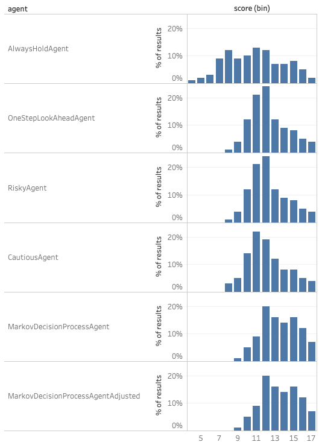
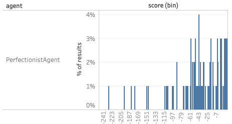

# dice-game
Dice Game simulator with AI that aims to maximise points. Project for MSc with Bath Uni.

## Introduction

This dice game consists of states, actions, and rewards (or punishments). We can therefore model it as 
a Markov Decision Process (Howard, 1960).

## Extremely Simple Agents

Two agents were provided with the exercise material. I have placed their code in agents/bad_agents.py.
1) AlwaysHoldAgent: Will always hold given any dice state
2) PerfectionistAgent: Will just keep rolling until the dice provides a perfect score

These agents do not perform very well, but do create a base line of performance. 

They had the following averages over 100 games:

| Agent                 | Mean Score |
|-----------------------|------------|
| AlwaysHoldAgent       |  10.82     |
| PerfectionistAgent    | -41.80     |

All agents were tested on the same games with identical seeds.

## One Step Look Ahead

To understand how the DiceGame class worked and to provide a low base line I decided to try a lazy way
of calculating whether or not an action should be taken. 

I cannot find a reference to this specific method online, probably because it's a bad version of
expected value evaluation. 

We assume that the value of a next state is equal to the final score minus the reward. 

For all dice roll outcomes, it is simple to calculate whether that outcome will be better or worse
than the current state of the dice. We also know the probability of each outcome.

Given our current state, for all actions I can take, I calculate the probability that action will
lead to a better state. If any of the actions' probabilities of success is above a preset "risk factor",
the Agent selects the one with the highest probability of success.

This is a fairly simple and has been implemented in agents/one_step_look_ahead.py.

You can adjust how risky the agent is by changing the risk factor. The basic risk factor I chose
was 50%. If the probability of an action giving a better outcome is > 50%, it will take the action. 
From this I have also written a cautious agent (will only take an action if there's > 60% 
chance of success) and a risky agent (will take an action if there's > 40% chance of success).

These agents tend to perform OK with the following average results over 100 games:

| Agent                 | Mean Score |
|-----------------------|------------|
| OneStepLookAheadAgent |  12.33     |
| RiskyAgent            |  12.33     |
| CautiousAgent         |  12.15     |

All one step look ahead agents perform better than the extremely simple agents.
However, the cautious agent under performs the other one step look aheads. 

## Value Iteration

### Theory

As this game can be modeled as a Markov Decision Process, there are a number of algorithms we can use
to create a policy set that performs better than looking ahead one step. Once such method is Value Iteration (Bellman, 1957).

For this, we need to calculate the value of being in a given state. For 3 dice, each with 6 sides, 
there are 56 unique states. The value of each state is dependent on the value of all other states.

The value of any given state is given by the following Bellman equation phrased as an update equation:

>Vk + 1(s) = maxa{ &sum;s', r p(s', r | s, a) (r + &gamma;Vk(s')) }

Where,

>V(s) = value of being in state s
>
>s = state 
>
>s' = next state
>
>a = action
>
>r = reward

For our dice game with 3 dice, there are two categories of actions that can be taken.

1) <b>Stick</b> has no reward (or penalty) associated with it. It ends the game and tallies up the final score.
2) <b>Roll</b> has a constant reward value associated with it. It will then randomly move us to another state. The
probability of moving to a given state is known. You have a choice of not rolling certain dice, which results in 
seven possible actions in this category (for 3 dice)  

Given that reward (r) and gamma (&gamma;) are constant along with the two categories of actions above
we can rewrite our version of the update equation. For simplicity, only one roll action will be expanded.

>Vk + 1(s) = maxa{stick, roll_1, roll_1_and_2, ..., roll_all}
>
>stick = value of the dice currently
>
>roll_1 = &sum;s', r p(s', r | s, roll_1) (r + &gamma;Vk(s'))
>
>roll_1 = &sum;s', r p(s', r | s, roll_1)r + &gamma;&sum;s', r p(s', r | s, roll_1)Vk(s'))
>
> &sum;s', r p(s', r | s, roll_1) r = 1
>
>roll_1 = r + &gamma;&sum;s', r p(s', r | s, roll_1) Vk(s') 
>
>Vk + 1(s) = maxa{stick, r + &gamma;&sum;s', r p(s', r | s, roll_1) Vk(s'), ..., etc}

### MarkovDecisionProcessAgent

The expected value of an action is implemented in the <b>_calculate_action_value</b> method of the MarkovDecisionProcessAgent 
class in agents/markov_decision_process_agent.py. 

    def _calculate_action_value(self, action, state):
        states, game_over, reward, probabilities = self._next_states_dict[state][action]
        if game_over:
            return self.game.final_scores[state]
        expected_value = sum([self._state_action_value[s] * p for p, s in zip(probabilities, states)])
        return reward + self._gamma * expected_value

Here the two categories of actions are broken out. If the action calls for stick, the value returned
is the final score for the given dice. If the action calls for some form of roll, the above equation
is calculated to produce an expected value for that action (taking into account the value of particular states).

This method is called by the <b>_update_state_best_action</b> method. This method looks at all possible actions for 
the given state and works out which action will produce the highest expected value. We then store the
best action value in a dict called _state_action_value_prime and update our list of deltas squared.

I use squared deltas as comparing square roots is far less efficient than comparing squares.

    def _update_state_best_action(self, state):
        action_values = [self._calculate_action_value(action=action, state=state) for action in self.game.actions]
        best_action_value = max(action_values)
        self._deltas_squared.append((self._state_action_value[state] - best_action_value) ** 2)
        self._state_action_value_prime[state] = best_action_value
        self._state_best_action[state] = self.game.actions[action_values.index(best_action_value)]

This method is called by <b>_iterate_all_states</b>. Iterate all states loops through all the possible states
to find the next state action values. It then updates all the state action values to be the new values.

The <b>_iterate_until_minimal_delta</b> method calls _iterate_all_states until the largest delta squared is 
smaller than the value of theta squared. Theta is a parameter given at time of input. This method is
run on initialisation of the class and takes around a second or two. 

I performed some tuning of theta and gamma which seemed to perform best at theta = 0.001 and gamma = 0.95. 
Decreasing the value of theta beyond 0.001 did not seem to increase the agent's game score. 
This optimisation was explored in utils/optimise_variables.py.

For 3 dice with 6 sides, MarkovDecisionProcessAgent ran <b>_iterate_all_states</b> 15 times before 
the max delta squared was less than theta squared.

 ### MarkovDecisionProcessAgentAdjusted
 
 Looking back at the <b>_update_state_best_action</b> method, there is an alternative way of 
 tracking the best action values. Rather than waiting until the end of a loop of all states, 
 we could update the state action values in this method. In the MarkovDecisionProcessAgentAdjusted 
 class this is what I do.

    def _update_state_best_action(self, state):
        action_values = [self._calculate_action_value(action=action, state=state) for action in self.game.actions]
        best_action_value = max(action_values)
        self._deltas_squared.append((self._state_action_value[state] - best_action_value) ** 2)
        self._state_action_value[state] = best_action_value
        self._state_best_action[state] = self.game.actions[action_values.index(best_action_value)]

This small change results in a decrease of the number of iterations of all states and does not affect
the performance of the agent. 

For 3 dice with 6 sides, MarkovDecisionProcessAgentAdjusted ran <b>_iterate_all_states</b> 11 times 
before the max delta squared was less than theta squared.

 ### Markov Results
 
 Both Markov agents performed identically and much better than all other agents. Below are the results
 of running 100 games.
 
| Agent                              | Mean Score |
|------------------------------------|------------|
| MarkovDecisionProcessAgent         |  13.53     |
| MarkovDecisionProcessAgentAdjusted |  13.53     |

## Comparison of performance

Table of average game score over 100 random games. 
All agents were given the same game and starting seed. 

| Agent                              | Mean Score |
|------------------------------------|------------|
| AlwaysHoldAgent                    |  10.82     |
| PerfectionistAgent                 | -41.80     |
| OneStepLookAheadAgent              |  12.33     |
| RiskyAgent                         |  12.33     |
| CautiousAgent                      |  12.15     |
| MarkovDecisionProcessAgent         |  13.53     |
| MarkovDecisionProcessAgentAdjusted |  13.53     |

Histograms comparing the performance of all the agents are presented below. 
The PerfectionistAgent is shown on a separate histogram as its scores were too low 
to be compared with the other agents.

The Markov Decision Process agents perform identically and out perform all other agents.

## References

Howard, R., 1960. <i>Dynamic Programming and Markov Processes</i>. Cambridge: The MIT Press.

Bellman, R., 1957. A Markovian Decision Process. <i>Indiana Univ. Math. J.</i> 6(4), pp.679-684.

